# Satellite Image Enhancement Studio Web Application

## Overview
A web-based platform for **Satellite Image Enhancement for Land Analysis**. The application enables users to upload raw satellite imagery (or select pre-loaded satellite samples), select an **Algorithm Category**, choose a **Specific Filter/Technique**, adjust parameters with real-time UI controls, and view the enhanced output side-by-side with quantitative metrics (PSNR, SSIM, MSE, Entropy), 2D FFT frequency spectrums, and RGB/intensity histograms.

---

## Key Features & UI Architecture

### 1. Interactive Image Studio & Comparison Viewer
- **Side-by-Side & Split Slider**: Interactive before/after split slider allowing users to swipe across the image to see subtle changes (e.g. edge sharpening on roads, noise reduction in water bodies).
- **Synchronized Zoom & Pan**: Inspect fine pixel-level satellite details.
- **Preset Satellite Samples**: Quick one-click loading of bundled images (`urban_area_Adelaide`, `vegetation`, `water_bodies`).
- **Drag-and-Drop Image Uploader**: Support for PNG, JPG, JPEG, TIFF satellite images.

### 2. Categorized Algorithms & Filter Selection

```mermaid
graph TD
    A[Satellite Image Studio] --> B[Spatial Domain]
    A --> C[Frequency Domain]
    A --> D[Contrast Enhancement]
    A --> E[Noise Removal]
    A --> F[Land Feature Highlighting]
    A --> G[Custom Pipeline]

    B --> B1[Smoothing: Mean, Gaussian, Median, Bilateral]
    B --> B2[Sharpening: Laplacian, Unsharp Masking, High-Boost]

    C --> C1[Low-Pass Filters: Ideal, Gaussian, Butterworth]
    C --> C2[High-Pass Filters: Ideal, Gaussian, Butterworth]
    C --> C3[FFT Magnitude Spectrum Visualizer]

    D --> D1[Global Histogram Equalization]
    D --> D2[CLAHE Local Adaptive Equalization]
    D --> D3[Gamma Correction]
    D --> D4[Linear Min-Max Contrast Stretching]

    E --> E1[Median Denoising]
    E --> E2[Non-Local Means NLM Denoising]
    E --> E3[Bilateral Denoising]

    F --> F1[Vegetation Highlight & Green Mask]
    F --> F2[Water Body Highlight & Blue Mask]
    F --> F3[Urban / Built-up Area Highlight]
    F --> F4[Composite Land-Cover Multi-Class Map]

    G --> G1[Chain Multiple Filters in Sequence]
```

### 3. Quantitative Evaluation & Analytics Dashboard
- **Quality Metrics Cards**: Live calculation of:
  - **PSNR (Peak Signal-to-Noise Ratio)** in dB
  - **SSIM (Structural Similarity Index)**
  - **MSE (Mean Squared Error)**
  - **Shannon Entropy** (Information gain / detail content)
  - **Execution Time (ms)**
- **Live Histograms**: Dual-channel histogram visualization (Original vs Enhanced) for R, G, B, and Luminance channels using Chart.js.
- **Frequency Spectrum 2D FFT View**: Visual display of the shifted Fourier frequency spectrum before and after filtering, as well as the filter frequency mask.
- **Land Cover Statistics**: Percentage breakdown of Vegetation, Water, and Urban area coverage.

### 4. Export & Download
- Download enhanced high-resolution image in PNG format.
- Export detailed evaluation summary report (CSV/JSON/Image comparison sheet).

---

## Proposed Changes

### Backend (FastAPI + Python DIP Pipeline)
We will build a high-performance backend server using **FastAPI** that wraps all existing DIP modules in `src/`.

#### [NEW] [app.py](file:///d:/antigravity/Satellite-Image-Enhancement/app.py)
- Web server initialization and API endpoints:
  - `GET /api/samples`: List available raw sample satellite images.
  - `GET /api/samples/{filename}`: Serve sample images.
  - `POST /api/process`: Execute selected algorithm/filter with customizable parameters.
  - `POST /api/pipeline`: Execute multi-step enhancement pipelines.
  - `POST /api/analyze-features`: Calculate land feature coverage percentages and masks.
  - `GET /`: Serve the frontend application.

#### [NEW] [src/web_service.py](file:///d:/antigravity/Satellite-Image-Enhancement/src/web_service.py)
- Adapter connecting the HTTP request parameters to the underlying DIP functions:
  - Integration with `spatial_domain/smoothing.py` and `sharpening.py`
  - Integration with `frequency_domain/low_pass_filter.py`, `high_pass_filter.py`, and `fft_utils.py` (with FFT spectrum generation)
  - Integration with `enhancement/contrast_enhancement.py`, `noise_removal.py`, and `feature_highlight.py`
  - Calculation of histograms and metrics via `evaluation/metrics.py`

---

### Frontend UI (Modern Single Page Application)
A modern, dark/light themed, responsive dashboard using Tailwind CSS, Lucide icons, Chart.js for histograms, and custom split-slider canvas.

#### [NEW] [static/index.html](file:///d:/antigravity/Satellite-Image-Enhancement/static/index.html)
- Main user interface layout:
  - Top Navigation Bar (Logo, Sample selector, Upload button, Dark/Light mode toggle, Reset button, Export button)
  - Left Sidebar: Dynamic Algorithm Category selector -> Specific Filter selector -> Dynamic Parameter controls (sliders & inputs tailored to each filter).
  - Main Viewport:
    - Interactive 20/20 Comparison Split-Slider
    - Original vs Enhanced side-by-side mode toggle
    - Zoom/Pan controller
  - Right / Bottom Analytics Panel:
    - PSNR, SSIM, MSE, Entropy metrics cards with delta badges
    - Live Interactive Histogram comparison (Chart.js)
    - 2D Frequency Spectrum / FFT visualizer (when Frequency Domain or FFT view is selected)
    - Land Cover segmentation breakdown (when Feature Highlighting is selected)

#### [NEW] [static/js/app.js](file:///d:/antigravity/Satellite-Image-Enhancement/static/js/app.js)
- Client-side application logic:
  - Algorithm configuration registry with parameter schema (min, max, step, default value, descriptions)
  - Split-slider image comparison interaction logic
  - Real-time / debounced API calls on parameter change
  - Chart.js histogram rendering & FFT spectrum rendering
  - Image upload and sample loading handling

#### [NEW] [static/css/style.css](file:///d:/antigravity/Satellite-Image-Enhancement/static/css/style.css)
- Sleek modern styling, smooth glassmorphism effects, custom slider styling, and animations.

---

### Project Configuration

#### [MODIFY] [requirements.txt](file:///d:/antigravity/Satellite-Image-Enhancement/requirements.txt)
- Add `fastapi`, `uvicorn`, and `python-multipart` to dependencies.

---

## Verification Plan

### Automated & Integration Tests
1. **Server Startup & API Test**:
   - Run `pytest` or a test script verifying that `/api/samples` and `/api/process` endpoints return status 200 with valid image payloads for all filter types.
2. **Algorithm Execution Verification**:
   - Test all filter types (Mean, Gaussian, Median, Bilateral, Laplacian, Unsharp, High-boost, Ideal LPF/HPF, Gaussian LPF/HPF, Butterworth LPF/HPF, HistEq, CLAHE, Gamma, Linear Stretch, Denoise NLM, Feature Highlighting).

### Manual UI Verification
1. Start the FastAPI server on `http://127.0.0.1:8000`.
2. Open the web interface in the browser.
3. Test uploading raw satellite images & switching between sample images.
4. Test changing filter categories and adjusting parameter sliders (e.g. `ksize`, `sigma`, `cutoff`, `order`, `clip_limit`, `gamma`).
5. Test the interactive split-slider before-after comparison.
6. Verify live histogram rendering and metric updates (PSNR, SSIM, MSE, Entropy).
7. Test downloading enhanced images and exporting reports.
